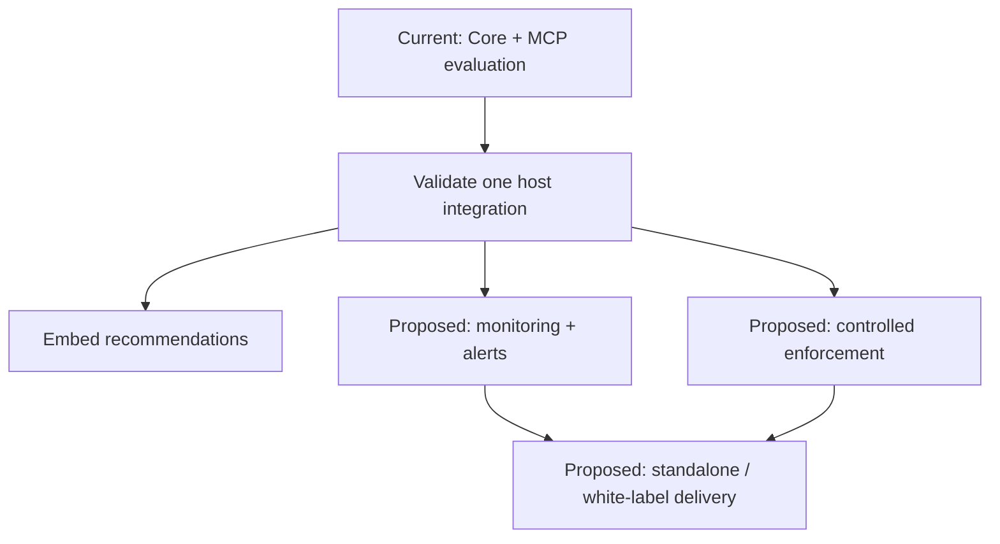

# FreshContext

**Build your context-integrity layer on an existing foundation.**

FreshContext evaluates candidate information before it reaches model reasoning. It combines source-aware freshness, ranking, explanations, provenance readiness and explicit recommendations about how context should be used.

Bring context from your retriever, database, agent or source adapter. Use the reusable Core inside your application, or connect through MCP. Shape the surrounding experience around your own workflows and platform.

This repository is the integrated FreshContext Core/MCP package. Core owns evaluation; MCP is the first live host/interface. Your application decides how to act on the recommendations.

[](https://www.npmjs.com/package/freshcontext-mcp)
[](https://opensource.org/licenses/MIT)
[](https://registry.modelcontextprotocol.io)

**Start here:** [Client setup](./docs/CLIENT_SETUP.md) · [Core API](./docs/CORE_API.md) · [Product roadmap](./docs/FUTURE_LANES.md#product-roadmap) · [Hosted demo](https://freshcontext-mcp.gimmanuel73.workers.dev/demo)

## What you can build on today

| Foundation | What it gives your application |
|---|---|
| **Core evaluation** | Normalize candidate signals, score freshness, rank results and inspect the reasons. |
| **Source profiles and decisions** | Interpret context for a source class and task: use, cite, background, refresh, verify, watch or exclude. |
| **Provenance helpers** | Inspect source and timing completeness and prepare content identity material when inputs are available. |
| **MCP and reference adapters** | Evaluate caller-provided context with `evaluate_context`, or invoke separate read-only adapters for source-specific intake. |
| **Specification and deployment assets** | Build against documented contracts and inspect the Worker, storage and operational reference surfaces. |

Core is available through `freshcontext-mcp/core`, with an edge entrypoint at `freshcontext-mcp/core/edge`. Hosted endpoints are versioned deployment surfaces and are verified separately from the package. See the [architecture boundary](#architecture-boundary).

## Your platform, your product direction

The existing evaluation foundation supports several directions. The product extensions below have explicit implementation and validation gates in the [roadmap](./docs/FUTURE_LANES.md#product-roadmap).

| Direction | Product experience | Boundary |
|---|---|---|
| **Embedded evaluation** | Add context recommendations and reasons to your retrieval, memory or agent workflow. | Current Core interfaces; each host integration requires validation. |
| **Context monitoring** | Show which information is aging, uncertain or due for review, with history and alerts. | Proposed dashboard and re-evaluation workflow. |
| **Controlled enforcement** | Map recommendations to review, refresh or exclusion before context is used. | Proposed host policy layer; evaluation alone does not block a request. |
| **Standalone or white-label delivery** | Package an experience under your own product design and operating model. | Proposed packaging route, with access, deployment, support and licensing requirements. |

Start with one integration. Preserve the evaluation contract while choosing the user experience, connectors and operating policies that fit your platform. Monitoring and enforcement can share the same decision outputs; white-label is a delivery choice for either route.

---

## The problem

Semantic relevance does not establish whether information is current, traceable or suitable for a particular task. A retriever can return a strong textual match whose date is missing, whose content is old, or whose extraction failed.

FreshContext makes those signals and their implications visible before the application assembles model context. It judges context usefulness and uncertainty; it does not certify truth.

The project started with a practical failure: I asked Claude to help me find a job. It returned openings with equal confidence, including jobs that had already closed. FreshContext grew from that freshness problem into a reusable context-evaluation boundary.

---

## The layer

FreshContext is **context integrity infrastructure for AI agents and retrieval systems**. It sits between retrieval and reasoning:

```text
candidate context
  -> FreshContext Core
  -> decision-ready context
  -> model / agent / app
```

FreshContext evaluates freshness, source profile, confidence, provenance readiness and failure signals before context reaches the LLM. Context-conditioned utility is returned as an explanatory sidecar; it does not control default ranking or decision labels. The temporal core uses Decay-Adjusted Relevancy:

```
R_t = R_0 · e^(−λt)
```

- `R_0` — base semantic relevancy (whatever your retriever already gives you)
- `λ` — source-specific decay constant (HN ≈14h half-life, blogs ≈29d, academic papers ≈1.6y)
- `t` — hours elapsed since publication
- `R_t` — decay-adjusted relevancy at query time

The evaluation step can work with candidate signals from an existing retriever. The host maps its inputs to the signal contract and decides what to do with the outputs; integration effort depends on that host.

**The reusable boundary is the foundation.** The named adapters demonstrate source intake, while the Core, source profiles, decision semantics and specification provide a shared contract for product development.

---

## The standard

Every FreshContext-compatible response wraps content in a structured envelope:

```
[FRESHCONTEXT]
Source: https://github.com/owner/repo
Published: 2024-11-03
Retrieved: 2026-03-05T09:19:00Z
Confidence: high
---
... content ...
[/FRESHCONTEXT]
```

**When** it was retrieved. **Where** it came from. **How confident** we are the date is accurate.

The FreshContext Specification v1.2 is published as an open standard under MIT licence. Any tool, agent, or system that wraps retrieved data in this envelope is FreshContext-compatible. → [Read the spec](./FRESHCONTEXT_SPEC.md) · [Read the methodology](./METHODOLOGY.md)

---

## Architecture boundary

FreshContext Core is the reusable center of the current integrated package. It owns signal normalization, freshness scoring, Source Profiles, decision output, envelope formatting, failure guards, shared types, rank/explain primitives, and the context-conditioned utility primitive.

MCP is the primary reference/interface implementation over Core. Claude Desktop is supported, but not required. The MCP tool surface exposes named reference adapters and a live interface for using the system.

The production Cloudflare Worker now uses Core-backed envelope generation. Worker-specific concerns remain outside Core: MCP transport, runtime guards, KV cache policy, cache metadata injection, JSON parse/replace cache helpers, D1 feeds, cron, rate limiting, and Store/feed scoring/provenance.

See [Core / MCP Boundary](./docs/CORE_MCP_BOUNDARY.md) for the current package boundary and the staged path toward a future standalone Core package.

### Core import path

FreshContext Core is also available directly from the current MCP package:

```ts
import {
  evaluateSignals,
  interpretEvaluations,
  getSourceProfile,
  normalizeSignal,
  calculateHaPriV2,
} from "freshcontext-mcp/core";
```

This is a Core subpath export inside `freshcontext-mcp`, not a standalone `freshcontext-core` package yet. The root package and `freshcontext-mcp` binary remain the MCP reference host.

---

## Primary MCP interface

The clearest MCP path is `evaluate_context`.

It accepts candidate context from any retriever, agent, database, local script, note parser, or adapter output:

```json
{
  "profile": "academic_research",
  "intent": "citation_check",
  "signals": [
    {
      "title": "Example source",
      "content": "Candidate context text...",
      "source": "https://example.com/source",
      "source_type": "arxiv",
      "published_at": "2026-05-24T12:00:00.000Z",
      "retrieved_at": "2026-05-24T13:00:00.000Z",
      "semantic_score": 0.92
    }
  ]
}
```

FreshContext returns decision-first output:

- Decision
- Meaning
- Action
- Warnings
- Source
- Freshness
- Rank score
- Utility
- Confidence
- Why

Structured results also include a `readable` object for humans:

```json
{
  "decision": "cite_as_primary",
  "label": "Cite as primary",
  "readable": {
    "label": "Primary source",
    "summary": "This source is strong enough to use as main evidence.",
    "why": [
      "Strong semantic match and current freshness for arxiv.",
      "source profile academic_research uses lenient date policy",
      "intent profile citation_check selected"
    ],
    "action": "Use this as main evidence while preserving citation and provenance.",
    "warnings": [
      "FreshContext judges citation readiness and context usefulness; it does not certify truth."
    ]
  }
}
```

The readable object translates Core decisions into user-facing language. It does not change ranking, decision labels, utility scoring, or source intake. Utility helps explain usefulness for the current question; it remains explanatory and does not control default decision labels or ranking.

FreshContext does not certify truth. It records why context was used, supported, questioned, refreshed, watched, or excluded before it reaches a model.

`evaluate_context` does not fetch URLs, crawl, scrape, browse, read folders, or call adapters. It only evaluates candidate context the caller provides.

Current boundary: `evaluate_context` ships in the npm/local stdio MCP server. The hosted Cloudflare Worker MCP endpoint is a separate deployment surface and is verified independently — check `/v1/health` for its live version and tool count rather than assuming parity with the package. The Worker remains a separate deployment surface, so future package interfaces should be re-verified remotely before being claimed live.

### Network Boundary

FreshContext's primary `evaluate_context` path does not fetch, crawl, scrape, browse, read folders, or call adapters. The MCP package also includes read-only reference adapters that use network access only when those adapter tools are invoked. Supply-chain scanners may therefore report package network access; that applies to the optional adapter surface, not to caller-provided context evaluation.

---

## Advanced Worker/feed surface

Beyond the per-call Core/MCP paths, the production Worker deployment exposes a continuous, decay-scored, deduplicated feed. This is an advanced deployment surface, not the required way to use FreshContext Core:

```
GET /v1/intel/feed/:profile_id?limit=20&min_rt=0
```

Every signal is stamped with `base_score`, `rt_score`, `entropy_level` (low / stable / high), `ha_pri_sig` (Ha-Pri v1 SHA-256 provenance reference), `semantic_fingerprint` (cross-adapter dedup), and `published_at`. Ready for direct LLM or agent consumption — no synthesis required.

Production endpoint: `https://freshcontext-mcp.gimmanuel73.workers.dev`

---

## Reference adapters

The repo ships named reference adapters that demonstrate how different source classes can become FreshContext-compatible. Each adapter keeps its own name because it represents a source boundary; the adapter count is operational proof, not the product headline.

### Intelligence
| Adapter | What it returns |
|---|---|
| `extract_github` | README, stars, forks, language, topics, last commit |
| `extract_hackernews` | Top stories or search results with scores and timestamps |
| `extract_scholar` | Research papers — titles, authors, years, snippets |
| `extract_arxiv` | arXiv papers via official API |
| `extract_reddit` | Posts and community sentiment from any subreddit |

### Competitive research
| Adapter | What it returns |
|---|---|
| `extract_yc` | YC company listings by keyword |
| `extract_producthunt` | Recent launches by topic |
| `search_repos` | GitHub repos ranked by stars with activity signals |
| `package_trends` | npm and PyPI metadata — version history, release cadence |

### Market data
| Adapter | What it returns |
|---|---|
| `extract_finance` | No-key Stooq quote data — close, OHLC, volume, quote timestamp, source. Up to 5 tickers. |
| `search_jobs` | Remote job listings from Remotive, RemoteOK, HN "Who is Hiring" |

### Composites — multiple sources, one call
| Adapter | Sources | Purpose |
|---|---|---|
| `extract_landscape` | 6 | YC + GitHub + HN + Reddit + Product Hunt + npm in parallel |
| `extract_idea_landscape` | 6 | HN + YC + GitHub + Jobs + npm + Product Hunt — full idea validation |
| `extract_gov_landscape` | 4 | Gov contracts + HN + GitHub + changelog |
| `extract_finance_landscape` | 5 | Finance + HN + Reddit + GitHub + changelog |
| `extract_company_landscape` | 5 | The full picture on any company |

### Official, regulatory, and procurement sources
| Adapter | Source | What it returns |
|---|---|---|
| `extract_changelog` | GitHub Releases / npm / auto-discover | Update history from any repo, package, or website |
| `extract_govcontracts` | USASpending.gov | US federal contract awards — company, amount, agency, period |
| `extract_sec_filings` | SEC EDGAR | 8-K filings — legally mandated material event disclosures |
| `extract_gdelt` | GDELT Project | Global news intelligence — 100+ languages, 15-min updates |
| `extract_gebiz` | data.gov.sg | Singapore Government procurement tenders — open dataset |

---

## Quick start

For Claude Desktop, Codex, `npx`, global npm, and source-checkout setup, see the concise [client setup guide](./docs/CLIENT_SETUP.md).

### Cloud (no install)

Add to your Claude Desktop config and restart:

**Mac:** `~/Library/Application Support/Claude/claude_desktop_config.json`
**Windows:** `%APPDATA%\Claude\claude_desktop_config.json`

```json
{
  "mcpServers": {
    "freshcontext": {
      "command": "npx",
      "args": ["-y", "mcp-remote", "https://freshcontext-mcp.gimmanuel73.workers.dev/mcp"]
    }
  }
}
```

Restart Claude. Done.

> Prefer a guided setup? Visit **[freshcontext-site.pages.dev](https://freshcontext-site.pages.dev)** — 3 steps, no terminal.

### Local (full Playwright)

**Requires:** Node.js 20+ ([nodejs.org](https://nodejs.org))

```bash
git clone https://github.com/PrinceGabriel-lgtm/freshcontext-mcp
cd freshcontext-mcp
npm install
npx playwright install chromium
npm run build
```

Add to Claude Desktop config:

**Mac:**
```json
{
  "mcpServers": {
    "freshcontext": {
      "command": "node",
      "args": ["/Users/YOUR_USERNAME/path/to/freshcontext-mcp/dist/server.js"]
    }
  }
}
```

**Windows:**
```json
{
  "mcpServers": {
    "freshcontext": {
      "command": "node",
      "args": ["C:\\Users\\YOUR_USERNAME\\path\\to\\freshcontext-mcp\\dist\\server.js"]
    }
  }
}
```

#### Mac troubleshooting

**"command not found: node"** — Use the full path:
```bash
which node  # copy this output, replace "node" in config
```

**Config file doesn't exist:**
```bash
mkdir -p ~/Library/Application\ Support/Claude
touch ~/Library/Application\ Support/Claude/claude_desktop_config.json
```

---

## Usage examples

The `npm run demo:*` commands below are source-checkout workflows for contributors and evaluators using a cloned repository. The published npm package is the MCP server/runtime package and does not include repo-only source examples or tests.

From an installed npm package, the supported runtime entrypoints are `npm start` and the `freshcontext-mcp` binary. Repo-only scripts such as tests, demos, smoke checks, and trust scans print a source-checkout notice when their source files are not present.

The Apify Actor entrypoint remains available in the source checkout for separate actor packaging, but it is intentionally not part of the published MCP npm runtime package.

### Release trust gate

Run the local release gate before a release, package review, demo, or PR review:

```bash
npm run trust:gate
```

The gate runs the Trust Scanner with repo-map reporting, npm package-boundary inspection, deterministic claim checks, and `--fail-on fail`. It is local-only, does not publish or deploy, does not send telemetry, and does not replace dedicated security scanners.

Generate review reports when you need a shareable summary:

```bash
npm run trust:report
npm run trust:report:json
```

To write a Markdown report file explicitly:

```bash
npm run trust:report -- --output TRUST_SCAN_REPORT.md
```

### Bring your own source list

FreshContext can evaluate candidate context you provide as a local JSON file:

```bash
npm run demo:evaluate:file
```

To pass a different file:

```bash
npm run demo:evaluate:file -- path/to/sources.json
```

Included examples:

```bash
npm run demo:evaluate:file -- examples/sources.academic.example.json
npm run demo:evaluate:file -- examples/sources.jobs.example.json
```

Minimal shape:

```json
{
  "profile": "academic_research",
  "intent": "citation_check",
  "signals": [
    {
      "title": "...",
      "content": "...",
      "source": "...",
      "source_type": "arxiv",
      "published_at": "...",
      "retrieved_at": "...",
      "semantic_score": 0.92
    }
  ]
}
```

This local demo does not fetch URLs, crawl, or read folders. It evaluates candidate context you provide and returns decision-first output: Decision, Meaning, Action, Warnings, and supporting metrics.

In an MCP client, use `evaluate_context` when you already have candidate context from another retriever, database, agent, or script:

```text
Use evaluate_context with profile "academic_research", intent "citation_check", and these candidate signals: [...]
```

Use the named reference adapters when you want FreshContext's current MCP package to fetch public source examples for you.

**Should I build this idea?**
```
Use extract_idea_landscape with idea "procurement intelligence saas"
```
Returns funding signal, pain signal, crowding signal, market signal, ecosystem signal, and launch signal — all timestamped.

**Full company intelligence in one call:**
```
Use extract_company_landscape with company "Palantir" and ticker "PLTR"
```
SEC filings + federal contracts + global news + changelog + market data.

**Did that company just disclose something material?**
```
Use extract_sec_filings with url "Palantir Technologies"
```
8-K filings are legally mandated within 4 business days of any material event — CEO change, acquisition, breach, major contract.

**Is this dependency still actively maintained?**
```
Use extract_changelog with url "https://github.com/org/repo"
```
Returns the last 8 releases with exact dates. If the last release was 18 months ago, you'll know before you pin the version.

---

## Deployment & infrastructure

The reference implementation runs on Cloudflare's global edge:

| Endpoint | Method | Purpose |
|---|---|---|
| `/` | GET | Service info + endpoint list |
| `/health` | GET | Liveness check |
| `/mcp` | POST | MCP JSON-RPC transport |
| `/demo` | GET | Live before/after demo (no auth token required) |
| `/briefing` | GET | Latest stored briefing |
| `/v1/intel/feed/:profile_id` | GET | DAR-scored intelligence feed |
| `/watched-queries` | GET | List all watched queries |

- **D1 database** — 18 watched queries running on 6-hour cron with relevancy scoring
- **KV-backed rate limiting** — 60 req/min per IP across all edge nodes
- **Defensive valves** — clock-skew rejection (5min tolerance), hard floor at R_t<5, lazy decay at read time
- **Provenance** — Ha-Pri v1 SHA-256 provenance stamps on stored signals; hard tamper enforcement is a future Ha-Pri v2 path
- **Schema migrations** — promise-gated, idempotent, run on first request after deploy

Production: `https://freshcontext-mcp.gimmanuel73.workers.dev`

---

## Roadmap

The direction is **an existing evaluation foundation that teams can embed, observe and extend into controlled workflows**. The diagram separates current interfaces from proposed products; it is not a release schedule.



**Next bounded proof:** evaluate a fixed set of caller-provided signals, preserve the reasons, and display their history in an observation-only prototype. Re-evaluation, alerting and any automatic action are separate host work. See [Product roadmap](./docs/FUTURE_LANES.md#product-roadmap) for completion gates and [First monitoring slice](./docs/FUTURE_LANES.md#first-monitoring-slice) for the concrete build specification.

### Existing milestones and implementation lanes

- [x] FreshContext Specification v1.2 published (MIT, open standard)
- [x] DAR engine with source-specific lambda constants
- [x] Ha-Pri v1 SHA-256 provenance references on stored signals
- [x] Semantic deduplication via fingerprinting
- [x] Live before/after demo at `/demo`
- [x] METHODOLOGY.md — methodology and engineering documentation
- [x] Named reference adapters across intelligence, competitive research, market data, and composites
- [x] Generic MCP `evaluate_context` tool for caller-provided candidate context
- [x] Core-backed envelope generation shared by npm/MCP and the Cloudflare Worker
- [x] Cloudflare Workers deployment — global edge, KV cache, KV rate limiting
- [x] Published on npm and listed for MCP usage; Apify/feed assets are separated from the normal MCP runtime package
- [x] Ha-Pri v2 Core helper and deterministic golden vectors
- [x] Ha-Pri v2 production-enforcement design document
- [ ] Ha-Pri v2 Worker/D1 production enforcement
- [x] GitHub Actions verification and Worker deployment workflow; npm publication remains a separate manual release action
- [ ] Webhook triggers — push high-entropy signals on threshold
- [ ] Context monitoring — evaluation history, scheduled re-evaluation, dashboard and alerts
- [ ] Controlled enforcement — explicit host policies, shadow evaluation, audit and rollback
- [ ] Standalone / white-label delivery — product configuration, access boundaries and operating model
- [ ] GKG upgrade for `extract_gdelt` — tone scores, goldstein scale, event codes

Future work is organized in [FreshContext Future Lanes](./docs/FUTURE_LANES.md). Roadmap items are not live product claims until implemented and validated.

---

## Contributing

PRs welcome. The highest-value contributions improve the caller-provided context path, decision output, host integrations, and FreshContext-compatible signal quality. New reference adapters are useful when they preserve source boundaries and emit timestamped, failure-honest context — see `src/adapters/` for examples and [`FRESHCONTEXT_SPEC.md`](./FRESHCONTEXT_SPEC.md) for the compatibility contract.

If you're building something FreshContext-compatible, open an issue and we'll add you to the ecosystem list.

---

## Trust and security

- [LICENSE](./LICENSE)
- [SECURITY.md](./SECURITY.md)
- [NOTICE.md](./NOTICE.md)
- [TRADEMARKS.md](./TRADEMARKS.md)
- [Dependency diligence notes](./docs/DEPENDENCY_DILIGENCE.md)
- [Release integrity notes](./docs/RELEASE_INTEGRITY.md)
- [Release notes](./docs/RELEASE_NOTES.md)

---

## License

MIT

---

*Built by Prince Gabriel — Grootfontein, Namibia 🇳🇦*
*"The work isn't gone. It's just waiting to be continued."*

---

**Also on:** [MCP Registry](https://registry.modelcontextprotocol.io) · [npm](https://www.npmjs.com/package/freshcontext-mcp)
