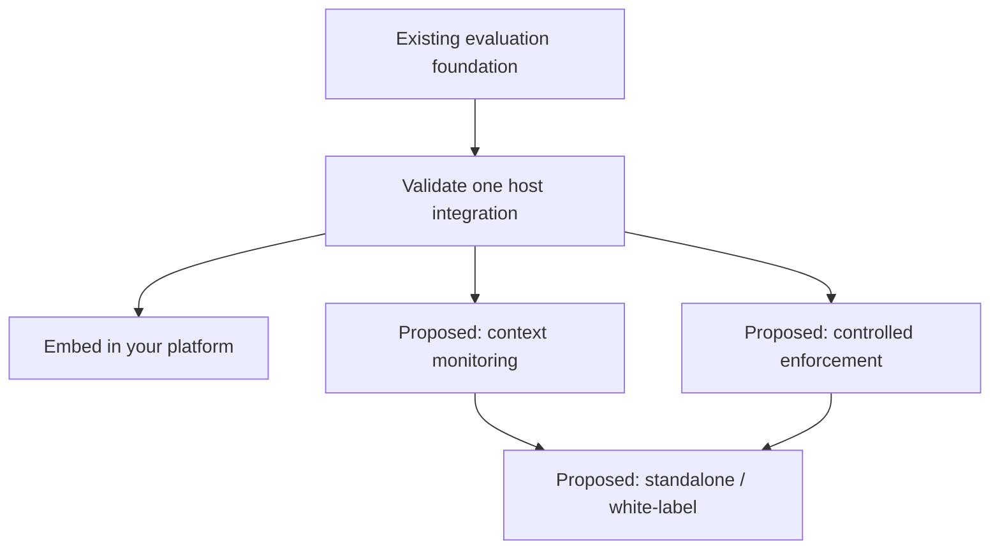

# FreshContext Future Lanes

Build your context-integrity product on an existing evaluation foundation. This roadmap describes how the current Core/MCP package can support embedded evaluation, context monitoring and controlled workflows, with standalone or white-label delivery as a packaging choice.

FreshContext is live today as an integrated MCP/Core package. Future work should stay in lanes, start with audits, and avoid feature sprawl.

The current package boundary is documented in [Core / MCP Boundary](./CORE_MCP_BOUNDARY.md). Treat MCP as the first live host over FreshContext Core, not as the whole product identity.

## Product roadmap

The current Core produces recommendations and explanations. The host owns persistence, scheduling, user access and any action taken from those recommendations. A dashboard makes decisions visible; an enforcement integration makes a chosen policy operational.

These are completion gates rather than promised delivery dates. **Proposed** means work to implement and validate, not an available hosted feature.

| Stage | Deliverable | Evidence required to complete it | Existing lane |
|---|---|---|---|
| **Foundation: current** | Core evaluation, signal contract, source profiles, decision helpers, MCP and reference adapters. | Verify the selected package or deployment version and replay its documented examples. | Phase 0; lanes 1-2 |
| **Integration baseline** | One host maps its candidate context to the existing contract and consumes the outputs. | Fixed fixtures, relevant release checks, recorded reasons, measured latency and decision errors. | Lanes 1-3 |
| **Observe: proposed** | Evaluation history, scheduled re-evaluation, dashboard and alerts. | Reproducible changes as information ages; unknown dates stay explicit; alerts deduplicate. | Lane 10 |
| **Control: proposed, optional** | A host maps supported recommendations to review, refresh or exclusion. | Shadow evaluation, demonstrated allow/block behavior, timeout handling, overrides, audit and rollback. | Lanes 7, 9 and 11, as needed |
| **Package: proposed, optional** | Embedded, standalone or white-label delivery of the chosen experience. | Configuration, access boundaries, deployment ownership, support, license review and compatibility. | Lanes 4 and 12, as needed |



A host can embed Core without building a dashboard. Monitoring can ship without automatic enforcement. An enforcement integration can use existing host observability rather than a new FreshContext dashboard. White-label describes how an experience is packaged; it is not a separate evaluation engine.

Keep cryptographic verification as a distinct validation track: signing, verification and enforcement are different capabilities. Before claiming independently verifiable production attestations, prove public-key verification of a real deployed output, tamper rejection, key rotation/history and compatibility. Basic monitoring does not depend on completing that track.

Product customization and release readiness are separate: teams choose connectors, dashboards, branding and policies; relevant tests, dependency review, runtime evidence and accurate documentation remain release requirements.

## Current Live Boundary

Live today:

- npm package: `freshcontext-mcp@latest`
- MCP stdio server
- `evaluate_context` MCP tool for caller-provided candidate context
- Signal Contract v1 as the stable candidate-context input shape
- 21 read-only reference adapters
- Core signal evaluation
- Source Profiles
- Decision Helper
- adapter registry metadata
- arXiv signal-to-decision proof
- bring-your-own-context local demos
- Trust Scanner release gate

Not live today:

- Operator / `retrieve(...)`
- browser crawling
- automatic local file, folder, or PDF scanning
- hosted dashboard or billing
- hard Ha-Pri v2 production enforcement
- standalone Core SDK package
- full adapter ingestion

## Phase 0: Stabilize The Signal Contract

Goal:

```text
Treat Signal Contract v1 as the stable input boundary for FreshContext.
```

Current contract:

```text
title + content + source + source_type + published_at + retrieved_at + semantic_score
```

This is live today. It is not the same thing as future context signals or control signals.

Tasks in this lane should document examples, invalid-input behavior, and normalization expectations. Do not expand required fields unless tests prove the new metadata improves decisions.

Future context signals, control signals, ingestion quality signals, structure preservation signals, and provenance confidence signals belong to later Decision Layer upgrades. They should remain optional metadata, not public required fields.

## Lane 1: Client Setup Reliability

Goal:

```text
Make Claude, Codex, and MCP-compatible clients connect reliably to the published package.
```

Start with setup guide audits, Claude Desktop local/global package paths, Codex local MCP config paths, stale global package fixes, and smoke command expectations.

Do not claim ChatGPT/OpenAI connector compatibility until a separate compatibility audit is done.

## Lane 2: Generic Context Evaluation

Goal:

```text
Let any caller provide candidate context and get decision-ready output.
```

Current live MCP path:

```text
evaluate_context
```

Hard boundary:

```text
No fetching, crawling, browsing, folder reading, or retrieval orchestration.
Only evaluate caller-provided candidate context.
```

Next work in this lane should focus on CLI, SDK, and REST ergonomics over the same caller-provided signal shape.

## Lane 3: Multi-Agent Context Handoff Proof

Goal:

```text
Show FreshContext as an independent context judgment layer between agents.
```

Proof shape:

```text
agent A produces candidate context
-> FreshContext evaluates it
-> agent B receives decision-ready context
```

Do not build a full multi-agent framework. Prove the handoff boundary.

## Lane 4: Core SDK Extraction Audit

Goal:

```text
Decide whether Core should become a standalone package.
```

Audit current Core exports, dependency boundaries, package shape, browser/node compatibility, public API stability, and what remains MCP-only.

No extraction without a compatibility plan. Keep `freshcontext-mcp` stable until a standalone Core package has compatibility tests and a migration path.

## Lane 5: Local/User Data Intake Audit

Goal:

```text
Explore student, research, and local-PC workflows safely.
```

Candidate sources include notes, PDFs, local JSON/CSV, citation exports, and database rows.

Hard boundary:

```text
Consent-first design. No automatic folder scanning or background file reading.
```

## Lane 6: Decision Layer Upgrade

Goal:

```text
Make decisions more useful without silently changing ranking.
```

Possible inputs include context utility, control signal, future context signal, ingestion quality, structure preservation, provenance confidence, confidence tiers, and source-profile-specific thresholds.

These are optional future metadata upgrades on top of Signal Contract v1. They should only be exposed when they make decisions clearer without making the caller-facing contract harder to use.

Do not make `utility.score` affect ranking or decision labels by default without a dedicated policy pass.

## Lane 7: Ha-Pri v2 Production Path

Goal:

```text
Turn Ha-Pri v2 from pure Core helper/design into production enforcement where appropriate.
```

Audit canonical content material, storage path, verification timing, failure mode, D1/Worker compatibility, and migration plan.

Do not claim hard tamper enforcement until the read/write path exists.

## Lane 8: GDELT GKG / Richer Source Intelligence

Goal:

```text
Upgrade GDELT intelligence with richer global knowledge graph signals.
```

Possible fields include tone, Goldstein scale, event codes, actor geography, theme density, and source timeline.

Do not mix this with generic context evaluation or local intake.

## Lane 9: Operator / Retrieve Orchestration

Goal:

```text
Coordinate retrieval only after the decision layer and adapter boundaries are mature.
```

Operator may later select adapters, call retrievers, refresh stale sources, and package best context.

Not now. Operator is a later workflow layer over Core and adapters.

## Lane 10: Context Monitoring

Goal: make the state of context understandable over time, using the current evaluation contract as the foundation.

Proposed host capabilities:

- Persist evaluations with source identity, source profile, content date, retrieval time, evaluation time, engine version, recommendation and reasons.
- Re-evaluate on an explicit schedule or source change; preserve prior evaluations rather than silently replacing them.
- Display date confidence, provenance readiness and recommended next steps alongside the score.
- Route and deduplicate alerts; assign an owner and record resolution.

Do not equate retrieval time with publication time. A newly fetched page may still contain old information. A static score is not continuous monitoring, and a decreasing freshness score does not establish that the content is false.

### First monitoring slice

Build an observation-only prototype around one fixed, caller-provided source set. Use the current file-input demo to establish the evaluation boundary, then add the smallest host needed for history and display.

| Scenario | What the prototype must show | Acceptance evidence |
|---|---|---|
| Dated signal evaluated again later | Content date, retrieval time and evaluation time remain distinct; any changed score or recommendation has a reason. | Replay using an explicit clock and declared source profile. Confirm the freshness calculation uses the intended time input. |
| Missing or unreliable date | Uncertainty is visible and the profile-specific recommendation is preserved. | No invented timestamp and no silent conversion of unknown freshness into a fresh result. |
| Failed source content | The failure and its reasons remain visible. | The failure fixture is not presented as usable, high-confidence context. |
| Repeated evaluation with the same inputs | Results can be compared without duplicate alerts. | Stable decision behavior for the same engine, profile and clock; explicit alert deduplication. |

The UI should answer: **What changed? Why? What needs attention? Who owns the next action?** Label all design fixtures as sample data until connected to actual evaluation events. This slice does not require autonomous crawling, billing or a new multi-agent framework.

## Lane 11: Controlled Enforcement

Goal: connect supported recommendations to explicit actions in a host workflow.

Start in shadow mode: record what the policy would do without changing the application's behavior. Agree a finite mapping to allow, review, refresh or exclude actions, then measure incorrect exclusions and missed interventions before enabling enforcement.

Completion requires:

- Tests of allowed and blocked paths at the actual point where context enters reasoning.
- Defined behavior for evaluator timeout, missing evidence and refresh failure, appropriate to the workflow's risk.
- Explicit authorized overrides with a reason, policy version, actor and outcome.
- Bounded refresh retries, observable failures and a rollback path.
- A record linking each host action to its evaluation; a recommendation is not proof that an action occurred.

Do not advertise a universal failsafe or truth certification. Expiry, revocation, source allowlists and cross-document conflicts require explicit support and validation before being promised. Lane 9 is needed only where the host must orchestrate retrieval or refresh; a host can instead use its own retriever.

## Lane 12: Product Packaging and White-Label Delivery

Goal: let teams choose the product experience and operating model around the shared evaluation contract.

Possible forms are an embedded component, a standalone monitoring experience, or a white-label product built on monitoring and/or controlled enforcement. These are proposed packaging options, not claims of a finished enterprise service.

Completion requires a defined configuration and theming surface, authentication and authorization, data and configuration isolation where multi-tenancy is offered, deployment and upgrade procedures, observability, support ownership and a third-party license/contributor inventory. See [LICENSE](../LICENSE), [NOTICE](../NOTICE.md) and [TRADEMARKS](../TRADEMARKS.md) for the current repository terms.

Use the current Core subpath where it fits. Extract a standalone SDK only through Lane 4's dependency, compatibility and migration audit. Branding changes must not silently alter the signal contract or decision semantics.

## Operating Rule

Every lane starts with:

```text
audit -> small patch -> validation -> stop
```

Do not combine lanes because the architecture is tempting.
